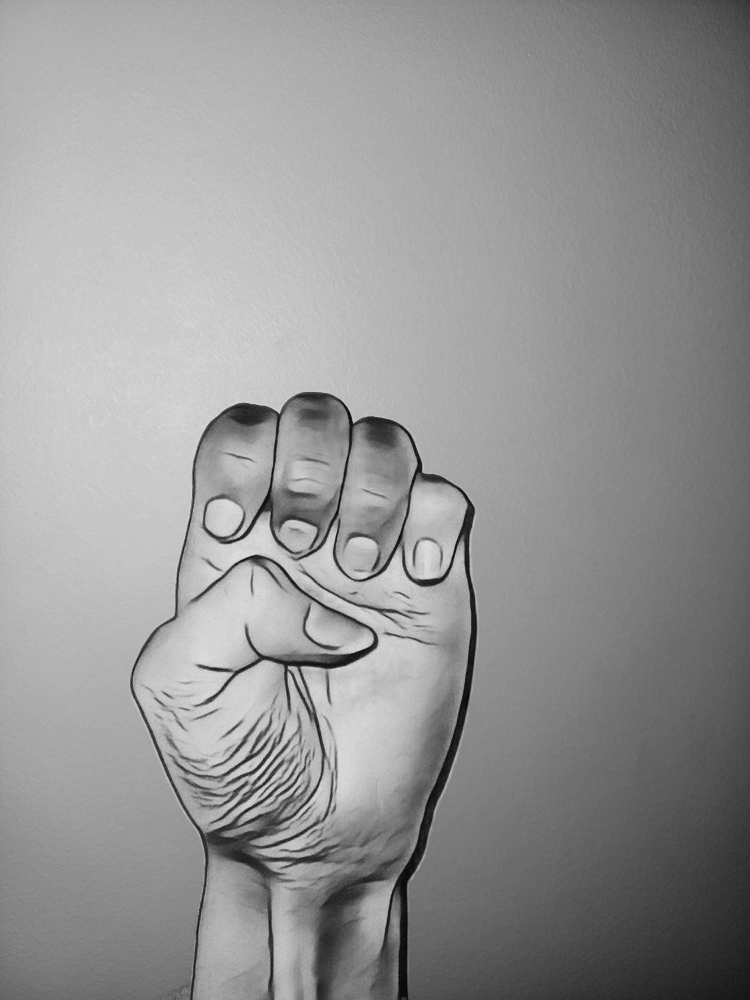
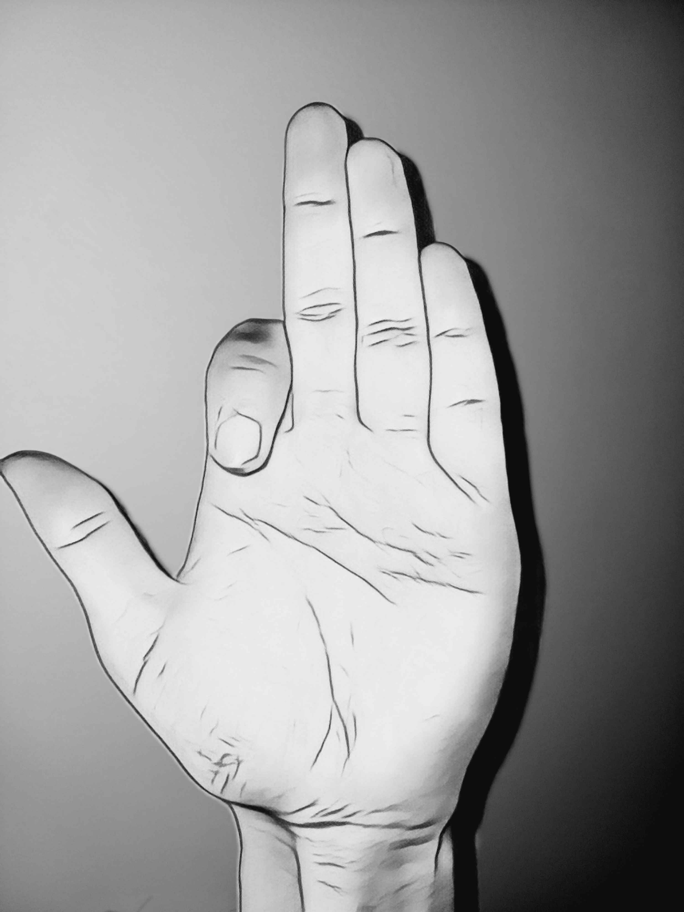
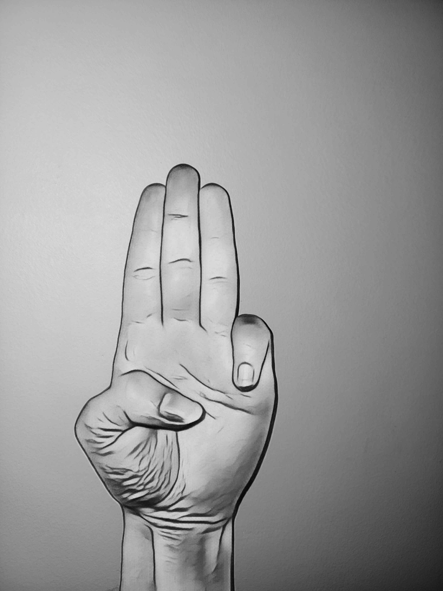

# Game with Hand Gesture Recognition

## Requirements
- Python 3.x
- OpenCV
- MediaPipe
- Pygame
- Numpy

The library can be installed with the following commande
```bash
pip install opencv-python mediapipe pygame numpy
```
## How to use it
### 1. The image folder must be in the same location as the file GameWithHandDetection.py
### 2. Run the file GameWithHandDetection.py
### 3. A window will open, activate the camera and the game will start
### 4. To exit the program, click on the red cross

## The game
### The rules
The player controls a character that can move all over the window but must pay attention to the monster because if he touches it he loses life points. when the character is no longer alive, the game is lost.

The goal of the game is to find a key hidden in one of the boxes of the game. The other boxes contain extra lives. When the key is found, a door appears, and the player must deliver the key to the door to win the game. 
To achieve this the player can use different gestures with his hands to control the actions of the character.
### The gestures 
- The right hand : controls the character's movements
    - hand open -> the character moves
    - hand close -> the character stops
    - displacement of the hand give the character's direction

- The left hand : controls the character's actions
    - break sign -> to break the boxes
    
    - SuperPower -> active the Superpower who can kill the monster (superpower move in the character's direction)
    
    - Takes items -> to take the item when the box is broken
    
    - Key release -> allow to win the game when the key is on the door
    
  
